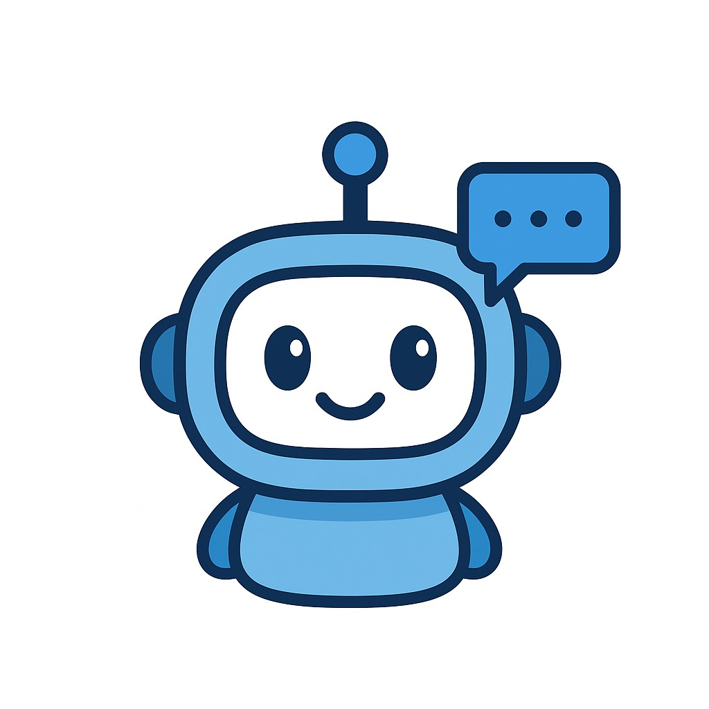

# AI Coach

[](https://ai-coach-teal.vercel.app)

A modern web application built with React and TypeScript that provides AI-powered productivity coaching.



## Technologies

- React 18
- TypeScript
- Vite
- TailwindCSS
- React Router DOM
- Radix UI Components

## Project Architecture

The project follows a modern application structure:

```
src/
├── api/         # API integration and services
├── assets/      # Static assets
├── components/  # Reusable UI components
├── context/     # React context providers
├── lib/         # Utility functions and shared logic
└── App.tsx      # Main application component
```

## Features

- Modern UI with TailwindCSS styling
- Type-safe development with TypeScript
- Component-based architecture
- Responsive design
- Client-side routing with React Router

## Getting Started

### Prerequisites

- Node.js (v16 or higher)
- npm

### Installation

1. Clone the repository:

```bash
git clone https://github.com/JCarlosR/ai-coach-react
cd ai-coach-react
```

2. Install dependencies:

```bash
npm install
```

### Development

To start the development server:

```bash
npm run dev
```

The application will be available at `http://localhost:5173`.

### Building for Production

To create a production build:

```bash
npm run build
```

To preview the production build:

```bash
npm run preview
```

## Available Scripts

- `npm run dev` - Start development server
- `npm run build` - Create production build
- `npm run preview` - Preview production build
- `npm run lint` - Run ESLint for code quality checks
